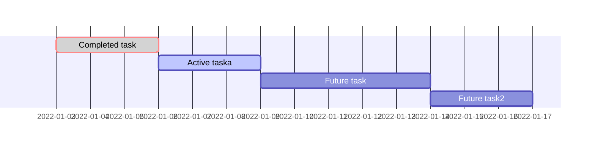

# echchのロードマップページへようこそ!!

このページは、試験運用中の美少女ゲームレビューサイト[echch]()のロードマップページです。

---

## echchとは

[echch]()は💕美少女ゲーム💕のレビューサイト(批評サイト)です。  
下記3点のグランドコンセプトをもとに作成しています。  
2022年7月1日(金)から試験運用を開始しており、現在、鋭意製作中です ✨

### Grand Concept
- 人気のゲームや自分が求めているゲームを簡単に探せる(強力な検索機能🔍)
- ユーザのレビュー情報を統計的に閲覧できる(レビュー機能と統計的な分析機能📊)
- 自分がプレイしたゲーム、積みゲー、気になっているゲームを管理できる(ゲーム管理機能📁)

### 製作者
[@isao](https://twitter.com/is_a_o), 
[@neiphbor](https://twitter.com/neiphbor), 
お問合せは[こちら]()から!!

---

## ロードマップ

### 実装予定の機能
- レビュー情報の分析機能
- 発売期間別のゲーム一覧機能(発売カレンダー)
- タグ検索機能
- 各種ランキング情報  
(独自アルゴリズムに基づく当月発売予定ゲームの注目度ランキングなど)
- マイページで管理するゲームの分析機能  
(〇〇メーカから発売されたゲームのうち70%をプレイ済みなどを表示)
- スマートフォン閲覧時の最適化
- メーカごとの特集ページ

### スケジュール 

